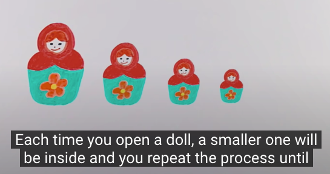

# Class03 Reading Notes

Reading

[In Tests We Trust - TDD with Python](https://code.likeagirl.io/in-tests-we-trust-tdd-with-python-af69f47e6932)

Create small tests to determine if your code will work   
use descriptive names- this can be considered your documentation   
The test file should have the same name as your original file.   
Structure your tests correctly: Example:

A convention widely used is the **AAA: Arrange, Act and Assert.**   
**Arrange:** you need to organize the data needed to execute that piece of code (input);   
**Act:** here you will execute the code being tested (exercise the behaviour);   
**Assert:** after executing the code, you will check if the result (output) is the same as you were expecting.   

### The cycle
made by three steps:   
🆘 Write a unit test and make it fail (it needs to fail because the feature isn’t there, right? If this test passes, call the Ghostbusters, really)   
✅ Write the feature and make the test pass! (you can dance after that)   
🔵 Refactor the code — the first version doesn’t need to be the beautiful one (don’t be shy)   

[If name equals main](https://www.geeksforgeeks.org/what-does-the-if-__name__-__main__-do/)

A module is a file containing Python definitions and statements. The file name is the module name with the suffix .py appended. 

Every Python module has it’s __name__ defined and if this is ‘__main__’, it implies that the module is being run standalone by the user and we can do corresponding appropriate actions.   
If you import this script as a module in another script, the __name__ is set to the name of the script/module.
Python files can act as either reusable modules, or as standalone programs.   
if __name__ == “main”: is used to execute some code only if the file was run directly, and not imported.

[Recursion](https://www.geeksforgeeks.org/recursion/)

The process in which a function calls itself directly or indirectly is called recursion and the corresponding function is called as recursive function.   

Videos

[What on Earth is Recursion](https://www.youtube.com/watch?v=Mv9NEXX1VHc)

**still confused but basically function that calls it self and cannot return a response until it reaches the end of the stack then works backwards until the end of the stack resolves to the first part of it.

[Optional: Python Modules and Packages Companion Video](https://realpython.com/courses/python-modules-packages/)

Bookmark and Review

[Google for Education: Python Lists](https://developers.google.com/edu/python/lists)

[Google for Education: Python Strings](https://developers.google.com/edu/python/strings)

[Python Modules and Packages](https://realpython.com/python-modules-packages/)

[Pytest Documentation](https://docs.pytest.org/en/latest/)

[PyTest Tutorial](https://www.guru99.com/pytest-tutorial.html)  
-Up to section Running tests in parallel

----

## Things I want to know more about

----
[Home](https://github.com/MISalz/401_Reading_Notes/blob/main/README.md)