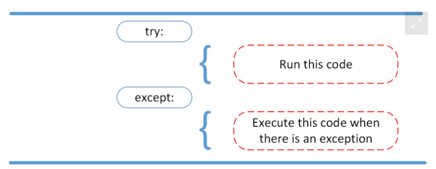
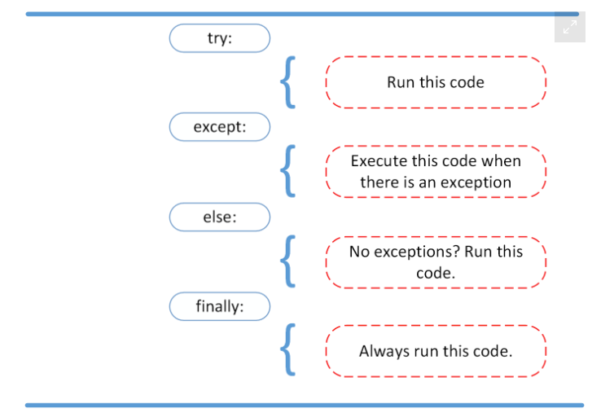

# Class01 Reading Notes

Reading
[Read & Write Files in Python ](https://realpython.com/read-write-files-python/)

##file three main parts:

Header: metadata about the contents of the file (file name, size, type, and so on)

Data: contents of the file as written by the creator or editor

End of file (EOF): special character that indicates the end of the file

## file paths three major parts:

Folder Path: the file folder location on the file system where subsequent folders are separated by a forward slash / (Unix) or backslash \ (Windows)
File Name: the actual name of the file
Extension: the end of the file path pre-pended with a period (.) used to indicate the file type

## opening closing file
This is done by invoking the open() built-in function. open() has a single required argument that is the path to the file. open() has a single return, the file object:

file = open('dog_breeds.txt')
finally:
    reader.close()

////
with open('dog_breeds.txt', 'r') as reader:

Character	Meaning
'r'	Open for reading (default)
'w'	Open for writing, truncating (overwriting) the file first
'rb' or 'wb'	Open in binary mode (read/write using byte data)

[Exceptions in Python](https://realpython.com/python-exceptions/)

Syntax errors occur when the parser detects an incorrect statement.

exception error This type of error occurs whenever syntactically correct Python code results in an error. 

We can use raise to throw an exception if a condition occurs. The statement can be complemented with a custom exception.

Instead of waiting for a program to crash midway, you can also start by making an assertion in Python. We assert that a certain condition is met.

The try and except block in Python is used to catch and handle exceptions. Python executes code following the try statement as a “normal” part of the program. The code that follows the except statement is the program’s response to any exceptions in the preceding try clause.

the else statement, you can instruct a program to execute a certain block of code only in the absence of exceptions.

Imagine that you always had to implement some sort of action to clean up after executing your code. Python enables you to do so using the finally clause.

Videos
[Read & Write Files in Python - Companion Video](https://realpython.com/courses/reading-and-writing-files-python/)

Bookmark and Review
[Reading and Writing Files in Python Quiz](https://realpython.com/quizzes/read-write-files-python/)