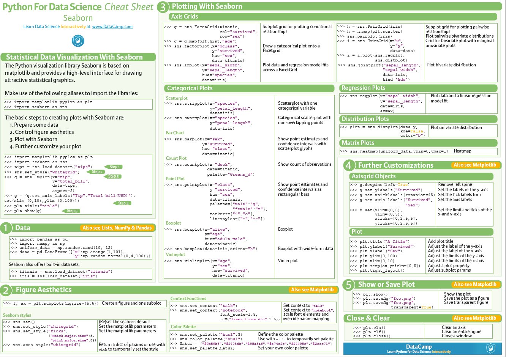

# Class14 Reading Notes

Reading
[Matplotlib Tutorial](https://www.labri.fr/perso/nrougier/teaching/matplotlib/)

Matplotlib comes with a set of default settings that allow customizing all kinds of properties. You can control the defaults of almost every property in matplotlib: figure size and dpi, line width, color and style, axes, axis and grid properties, text and font properties and so on

A figure in matplotlib means the whole window in the user interface. Within this figure there can be subplots. While subplot positions the plots in a regular grid, axes allows free placement within the figure.

When we call plot, matplotlib calls gca() to get the current axes and gca in turn calls gcf() to get the current figure. If there is none it calls figure() to make one, strictly speaking, to make a subplot(111). Let's look at the details.

With subplot you can arrange plots in a regular grid. You need to specify the number of rows and columns and the number of the plot.

The most easy way to make an animation in matplotlib is to declare a FuncAnimation object that specifies to matplotlib what is the figure to update, what is the update function and what is the delay between frames.

Bookmark and Review
[Seaborn Tutorial](https://seaborn.pydata.org/tutorial.html)

[Bokeh Tutorial](https://mybinder.org/v2/gh/bokeh/bokeh-notebooks/master?filepath=tutorial%2F00%20-%20Introduction%20and%20Setup.ipynb)
What is Bokeh¶
Bokeh is an interactive visualization library that targets modern web browsers for presentation. It is good for:

Interactive visualization in modern browsers
Standalone HTML documents, or server-backed apps
Expressive and versatile graphics
Large, dynamic or streaming data
Easy usage from python (or Scala, or R, or...)
And most importantly:

NO JAVASCRIPT REQUIRED
Bokeh is an interactive visualization library for modern web browsers. It provides elegant, concise construction of versatile graphics, and affords high-performance interactivity over large or streaming datasets. Bokeh can help anyone who would like to quickly and easily make interactive plots, dashboards, and data applications.

Cheat Sheet
[Seaborn Cheat Sheet](https://s3.amazonaws.com/assets.datacamp.com/blog_assets/Python_Seaborn_Cheat_Sheet.pdf)

----

## Things I want to know more about

----
[Home](https://github.com/MISalz/401_Reading_Notes/blob/main/README.md)