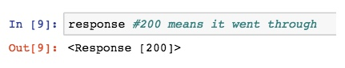
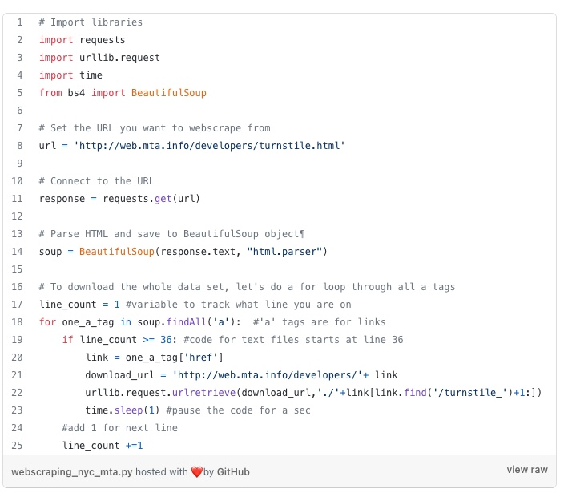

# Class17 Reading Notes

### Reading
[Web Scrape with Python in 4 minutes](https://towardsdatascience.com/how-to-web-scrape-with-python-in-4-minutes-bc49186a8460)

Web scraping is a technique to automatically access and extract large amounts of information from a website, which can save a huge amount of time and effort.

**Important notes about web scraping:**

Read through the website’s Terms and Conditions to understand how you can legally use the data. Most sites prohibit you from using the data for commercial purposes.

Make sure you are not downloading data at too rapid a rate because this may break the website. You may potentially be blocked from the site as well.

We start by importing the following libraries.

import requests
import urllib.request
import time
from bs4 import BeautifulSoup

Next, we set the url to the website and access the site with our requests library.

url = \<your URL>

response = requests.get(url)

If the access was successful, you should see the following output:

Next we parse the html with BeautifulSoup so that we can work with a nicer, nested BeautifulSoup data structur

soup = BeautifulSoup(response.text, “html.parser”)

Next we parse the html with BeautifulSoup so that we can work with a nicer, nested BeautifulSoup data structure.

soup.findAll('a')

Next, let’s extract the actual link that we want. 

one_a_tag = soup.findAll(‘a’)[38]
link = one_a_tag\[‘href’]

we should include this line of code so that we can pause our code for a second so that we are not spamming the website with requests. This helps us avoid getting flagged as a spammer.

time.sleep(1)

[What is Web Scraping?](https://en.wikipedia.org/wiki/Web_scraping)

Web scraping, web harvesting, or web data extraction is data scraping used for extracting data from websites. The web scraping software may directly access the World Wide Web using the Hypertext Transfer Protocol or a web browser. While web scraping can be done manually by a software user, the term typically refers to automated processes implemented using a bot or web crawler. It is a form of copying in which specific data is gathered and copied from the web, typically into a central local database or spreadsheet, for later retrieval or analysis.

### Human copy-and-paste
The simplest form of web scraping is manually copying and pasting data from a web page into a text file or spreadsheet. Sometimes even the best web-scraping technology cannot replace a human's manual examination and copy-and-paste, and sometimes this may be the only workable solution when the websites for scraping explicitly set up barriers to prevent machine automation.

### Text pattern matching
A simple yet powerful approach to extract information from web pages can be based on the UNIX grep command or regular expression-matching facilities of programming languages (for instance Perl or Python).

### HTTP programming
Static and dynamic web pages can be retrieved by posting HTTP requests to the remote web server using socket programming.

### HTML parsing
Many websites have large collections of pages generated dynamically from an underlying structured source like a database. Data of the same category are typically encoded into similar pages by a common script or template. In data mining, a program that detects such templates in a particular information source, extracts its content and translates it into a relational form, is called a wrapper. Wrapper generation algorithms assume that input pages of a wrapper induction system conform to a common template and that they can be easily identified in terms of a URL common scheme. Moreover, some semi-structured data query languages, such as XQuery and the HTQL, can be used to parse HTML pages and to retrieve and transform page content.

### DOM parsing
Further information: Document Object Model
By embedding a full-fledged web browser, such as the Internet Explorer or the Mozilla browser control, programs can retrieve the dynamic content generated by client-side scripts. These browser controls also parse web pages into a DOM tree, based on which programs can retrieve parts of the pages. Languages such as Xpath can be used to parse the resulting DOM tree.

### Vertical aggregation
There are several companies that have developed vertical specific harvesting platforms. These platforms create and monitor a multitude of "bots" for specific verticals with no "man in the loop" (no direct human involvement), and no work related to a specific target site. The preparation involves establishing the knowledge base for the entire vertical and then the platform creates the bots automatically. The platform's robustness is measured by the quality of the information it retrieves (usually number of fields) and its scalability (how quick it can scale up to hundreds or thousands of sites). This scalability is mostly used to target the Long Tail of sites that common aggregators find complicated or too labor-intensive to harvest content from.

### Semantic annotation recognizing
The pages being scraped may embrace metadata or semantic markups and annotations, which can be used to locate specific data snippets. If the annotations are embedded in the pages, as Microformat does, this technique can be viewed as a special case of DOM parsing. In another case, the annotations, organized into a semantic layer, are stored and managed separately from the web pages, so the scrapers can retrieve data schema and instructions from this layer before scraping the pages.

### Computer vision web-page analysis
There are efforts using machine learning and computer vision that attempt to identify and extract information from web pages by interpreting pages visually as a human being might.

[How to scrape websites without getting blocked](https://www.scrapehero.com/how-to-prevent-getting-blacklisted-while-scraping/)

Web spiders should ideally follow the robot.txt file for a website while scraping.

You can find the robot.txt file on websites. It is usually the root directory of a website – http://example.com/robots.txt.

If it contains lines like the ones shown below, it means the site doesn’t like and does not want to be scraped.

User-agent: *

Disallow:/ 

**Here are a few easy giveaways that you are bot/scraper/crawler –**

<ul><li>Scraping too fast and too many pages, faster than a human ever can
</li><li>Following the same pattern while crawling. For example – go through all pages of search results, and go to each result only after grabbing links to them. No human ever does that.
</li><li>Too many requests from the same IP address in a very short time
</li><li>Not identifying as a popular browser. You can do this by specifying a ‘User-Agent’.
</li><li>using a user agent string of a very old browser</li></ul>

Use auto throttling mechanisms which will automatically throttle the crawling speed based on the load on both the spider and the website that you are crawling. Adjust the spider to an optimum crawling speed after a few trial runs. Do this periodically because the environment does change over time.

Incorporate some random clicks on the page, mouse movements and random actions that will make a spider look like a human.

### Make requests through Proxies and rotate them as needed
Create a pool of IPs that you can use and use random ones for each request. Along with this, you have to spread a handful of requests across multiple IPs.

Rotate User Agents and corresponding HTTP Request Headers between requests
A user agent is a tool that tells the server which web browser is being used. If the user agent is not set, websites won’t let you view content. Every request made from a web browser contains a user-agent header and using the same user-agent consistently leads to the detection of a bot. You can get your User-Agent by typing ‘what is my user agent’ in Google’s search bar. The only way to make your User-Agent appear more real and bypass detection is to fake the user agent. Most web scrapers do not have a User Agent by default, and you need to add that yourself.

Use a headless browser like Puppeteer, Selenium or Playwright
If none of the methods above works, the website must be checking if you are a REAL browser.

The simplest check is if the client (web browser) can render a block of JavaScript. If it doesn’t, then it pretty much flags the visitor to be a bot. While it is possible to block running JavaScript in the browser, most of the Internet sites will be unusable in such a scenario and as a result, most browsers will have JavaScript enabled.

## Beware of Honey Pot Traps
When following links always take care that the link has proper visibility with no nofollow tag. Some honeypot links to detect spiders will have the CSS style display:none or will be color disguised to blend in with the page’s background color.

### Videos
[Track Amazon Prices](https://www.youtube.com/watch?v=Bg9r_yLk7VY)

### Bookmark and Review
[Beautiful Soup](https://www.crummy.com/software/BeautifulSoup/)

----

## Things I want to know more about

----
[Home](https://github.com/MISalz/401_Reading_Notes/blob/main/README.md)