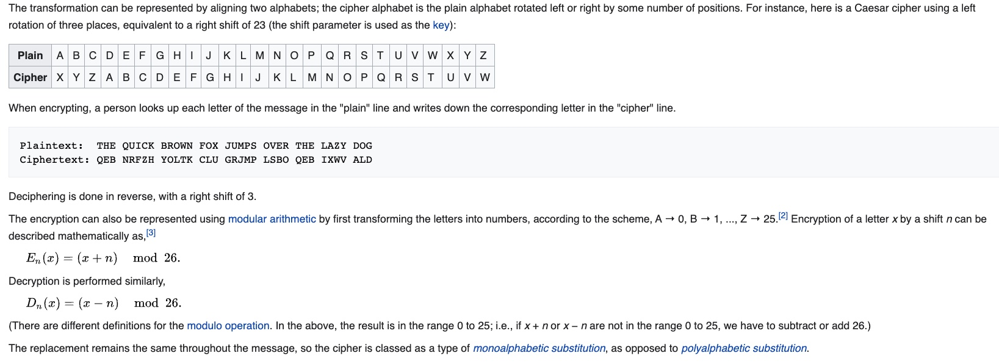

# Class18 Reading Notes

### Reading
[Encryption, Decryption & Hacking](https://www.khanacademy.org/computing/computers-and-internet/xcae6f4a7ff015e7d:online-data-security/xcae6f4a7ff015e7d:data-encryption-techniques/a/encryption-decryption-and-code-cracking)

## Encrypting a message
Imagine Caesar wants to send this message:
SECRET MEETING AT THE PALACE 

Here's what that might look like encrypted:
YKIXKZ SKKZOTM GZ ZNK VGRGIK

That looks an awfully lot like gobbledygook at first, but this encrypted message is actually very related to the original text.

The Caesar Cipher is a simple substitution cipher which replaces each original letter with a different letter in the alphabet by shifting the alphabet by a certain amount.

## Decrypting a message
According to historical records, Caesar always used a shift of 3. As long as his message recipient knew the shift amount, it was trivial for them to decode the message.

## Cracking the cipher
Imagine that a very literate and savvy enemy intercepts one of Caesar's messages.

RZ VMZ WMDIBDIB VGG AJMXZN OJ EJDI RDOC XGZJKVOMV OJ YZAZVO OCZ ZIZHT LPZZI VO OCZ IDGZ YZGOV

That enemy does not know that Caesar always uses a shift of 3, so he must attempt to "crack" the cipher without knowing the shift.

There are three main techniques he could use: frequency analysis, known plaintext, and brute force.

## Frequency analysis
Human languages tend to use some letters more than others. For example, "E" is the most popular letter in the English language. We can analyze the frequency of the characters in the message and identify the most likely "E" and narrow down the possible shift amounts based on that.

[Ceasar Cipher](https://en.wikipedia.org/wiki/Caesar_cipher)

In cryptography, a Caesar cipher, also known as Caesar's cipher, the shift cipher, Caesar's code or Caesar shift, is one of the simplest and most widely known encryption techniques. It is a type of substitution cipher in which each letter in the plaintext is replaced by a letter some fixed number of positions down the alphabet. For example, with a left shift of 3, D would be replaced by A, E would become B, and so on. The method is named after Julius Caesar, who used it in his private correspondence.

The Caesar cipher can be easily broken even in a ciphertext-only scenario. Two situations can be considered:

1. an attacker knows (or guesses) that some sort of simple substitution cipher has been used, but not specifically that it is a Caesar scheme;
2. an attacker knows that a Caesar cipher is in use, but does not know the shift value.

* In the first case, the cipher can be broken using the same techniques as for a general simple substitution cipher, such as frequency analysis or pattern words. While solving, it is likely that an attacker will quickly notice the regularity in the solution and deduce that a Caesar cipher is the specific algorithm employed.

* In the second instance, breaking the scheme is even more straightforward. Since there are only a limited number of possible shifts (25 in English), they can each be tested in turn in a brute force attack.[17] One way to do this is to write out a snippet of the ciphertext in a table of all possible shifts[18] – a technique sometimes known as "completing the plain component".[19] The example given is for the ciphertext "EXXEGOEXSRGI"; the plaintext is instantly recognisable by eye at a shift of four. Another way of viewing this method is that, under each letter of the ciphertext, the entire alphabet is written out in reverse starting at that letter. This attack can be accelerated using a set of strips prepared with the alphabet written down in reverse order. The strips are then aligned to form the ciphertext along one row, and the plaintext should appear in one of the other rows.

### Videos
[Cryptography Crash Course](https://www.youtube.com/watch?v=jhXCTbFnK8o)

### Additional Resources
[Introduction to Cryptography](https://thebestvpn.com/cryptography/)

[How Computers Generate Random Numbers](https://www.howtogeek.com/183051/htg-explains-how-computers-generate-random-numbers/)

----

## Things I want to know more about

----
[Home](https://github.com/MISalz/401_Reading_Notes/blob/main/README.md)