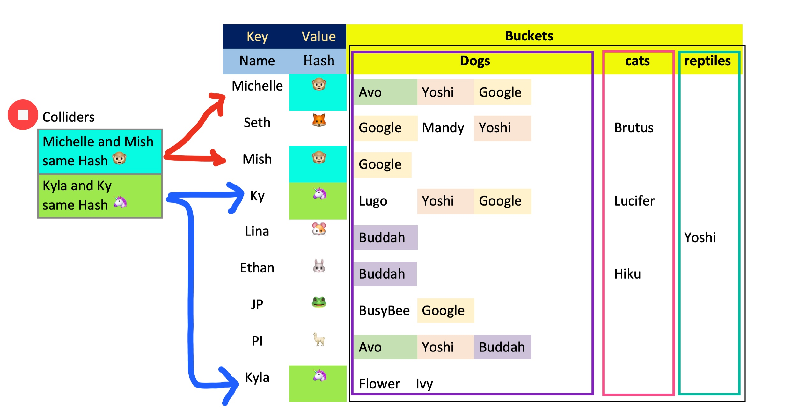

# Class32 Reading Notes

Implementation: Hash Tables

Hash tables are a way of storing big data in as a data structure that is reassigned as Key value pairs with the Hash being its unique ID. Although normally stored with a unique code. Ive chosen to use emojis to demonstrate my understanding of Hash tables. 

In the example below we have my family by name as they Key: the hash is an emoji assigned should be unique to its Key. Each bucket of data represents the types of pets they each have or may have shared growing up. As you can see Michelle and Mish are both assigned Monkeys and Kyla and Ky are both assigned Unicorns. Since both of these people instances are assigned same hash value's they are considered colliders. 

# Resources
[Read Intro to Hash Tables](https://codefellows.github.io/common_curriculum/data_structures_and_algorithms/Code_401/class-30/resources/Hashtables.html)
[Watch what is a hash table?](https://www.youtube.com/watch?v=MfhjkfocRR0)
[Read basics of hash tables](https://www.hackerearth.com/practice/data-structures/hash-tables/basics-of-hash-tables/tutorial/)
[Skim hash table wiki](https://en.wikipedia.org/wiki/Hash_table)

----

## Things I want to know more about

----
[Home](https://github.com/MISalz/401_Reading_Notes/blob/main/README.md)