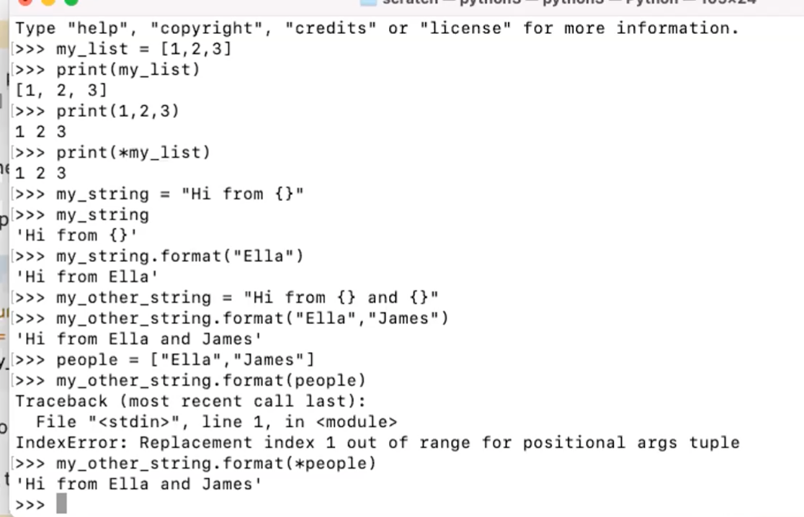

# 401d18 Lecture Times
Instructor **JB Tellez**

**Note: Lecture times are based on instructor screen clock**

|Class #|Times|Links|
|---|---|---
|**4/18/2022 - Class 01:**|<ul><li>9:00 Intro</li><li>10:13 languages and code editor</li><li>10:24 Canvas overview</li><li>10:48 Python overview</li><li>10:55 Python Version python3 -V make virtual environment (like NPM) python3 -m venv .venv you need to activate virtual enviorment source .venv/bin/activate  when you get the (.venv) before folder name it means its activated  deactivate when in virtual enviorment, you can run command below to see version running on virtual enviorment. python -V</li><li>11:24 afterbreak discussion</li><li>11:27 lab01 overview</li><li>11:37 git repo  git init </li><li>11:39 gst.  make sure you git add . and git commit before cloning repo </li><li>11:40 github do not initilize with Readme and license or gitignore</li><li>11:45 data structures and algorithms lab</li></ul>|<ol><li>Data Structures https://pragprog.com/titles/jwdsal2/a-common-sense-guide-to-data-structures-and-algorithms-second-edition/</li><li>lab submission instructions https://codefellows.github.io/code-401-python-guide/reference/submission-instructions/labs/</li><li>Python arrays geeksforgeeks.org/python-arrays/</li><li>readme template  https://codefellows.github.io/code-401-python-guide/reference/submission-instructions/labs/README-template.html</li><li>Invision (whiteboarding) https://www.invisionapp.com/home</li></ol>
|**4/19/2022 - Class 02:**|<ul><li>09:05 Whiteboard review (jamesB)</li><li>09:50 pep8</li><li>09:56 code_challenge2 overview</li><li>10:23 Big0</li><li>10:31 lab01 review (chrisY)</li><li>10:37 dashes + length of item</li><li>11:11 test driven development (prove that your code is working as expected)   agile (extreme programming)</li><li>11:15 democode</li><li>11:21 dunder init</li>pytest is not built into python. you will need to install PIP. install at same level where your .venv is (where your virtual environment is located) pip install pytest</li> <li>11:25 requirements</li><li>11:28 create pytest   assert will evaluate if something is equal to another thing. will stop if false modulo operator %</li><li>12:05 Lab02 overview</li></ul>|<ol><li>pep8 https://peps.python.org/pep-0008/</li><li>RealPython https://realpython.com/</li></ol>
|**4/20/2022 - Class 03:**|<ul><li> 09:02 Class Agenda</li><li>09:07 code_challenge2 review</li><li>10:16 code_challenge3 overview</li><li>10:40 lab03 overview</li><li>10:45 unpacking lists <li>10:57 tuple</li><li>11:17 Lecture</li><li>11:20 File io</li><li>11:27 finding documentation/help</li><li>11:31 open image</li><li>11:40 exceptions on Vscode</li><li>11:56 lab03 review instructions </li><li>12:00 the difference between a module and a script is that a script is meant to be directly run and a module is. sometimes you can run as a module, sometimes you can run as script</li></ul>|<li>Jupyter https://jupyter.org/</li><li>str format https://www.w3schools.com/python/ref_string_format.asp</li><li>unpack list https://realpython.com/python-kwargs-and-args/#unpacking-with-the-asterisk-operators</li></ol>
|**4/21/2022 - Class 04:**| |
|**4/22/2022 - Class 05:**| |
|**4/25/2022 - Class 06:**| |
|**4/26/2022 - Class 07:**| |
|**4/27/2022 - Class 08:**| |
|**4/28/2022 - Class 09:**| |
|**4/29/2022 - Class 10:**| |
|**5/02/2022 - Class 11:**| |
|**5/03/2022 - Class 12:**| |
|**5/04/2022 - Class 13:**| |
|**5/05/2022 - Class 14:**| |
|**5/06/2022 - Class 15:**| |
|**5/09/2022 - Class 16:**| |
|**5/10/2022 - Class 17:**| |
|**5/11/2022 - Class 18:**| |
|**5/12/2022 - Class 19:**| |
|**5/16/2022 - Class 20:**| |
|**5/23/2022 - Class 21:**| |
|**5/24/2022 - Class 22:**| |
|**5/25/2022 - Class 23:**| |
|**5/26/2022 - Class 24:**| |
|**5/27/2022 - Class 25:**| |
|**5/30/2022 - Class 26:**| |
|**5/31/2022 - Class 27:**| |
|**6/01/2022 - Class 28:**| |
|**6/02/2022 - Class 29:**| |
|**6/03/2022 - Class 30:**| |
|**6/06/2022 - Class 31:**| |
|**6/07/2022 - Class 32:**| |
|**6/08/2022 - Class 33:**| |
|**6/09/2022 - Class 34:**| |
|**6/10/2022 - Class 35:**| |
|**6/13/2022 - Class 36:**| |
|**6/14/2022 - Class 37:**| |
|**6/15/2022 - Class 38:**| |
|**6/16/2022 - Class 39:**| |
|**6/17/2022 - Class 40:**| |
|**6/13/2022 - Class 41:**| |
|**6/14/2022 - Class 42:**| |

---
### [Home](https://github.com/MISalz/401_Reading_Notes)

